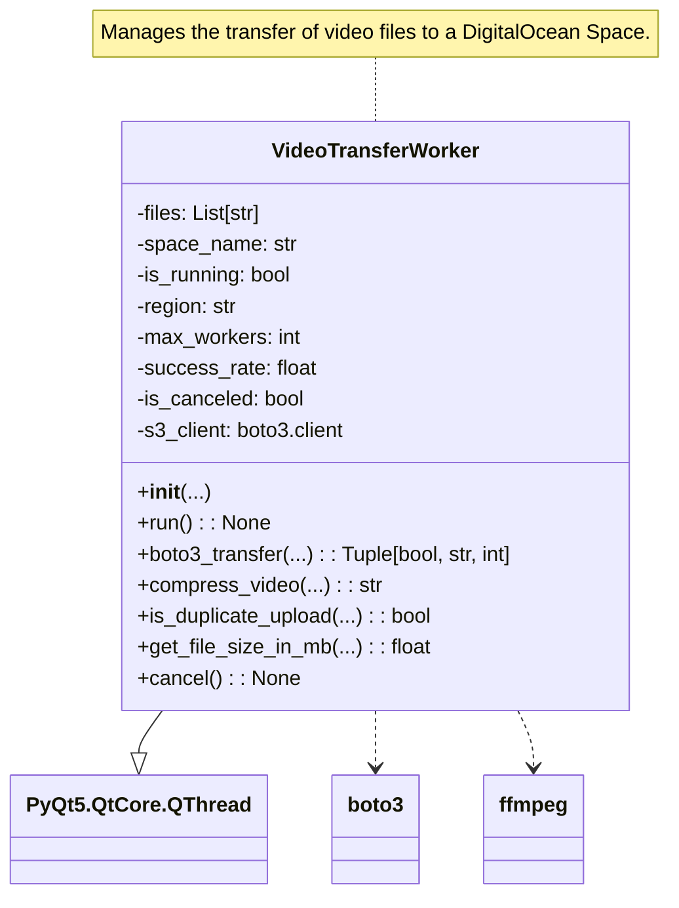
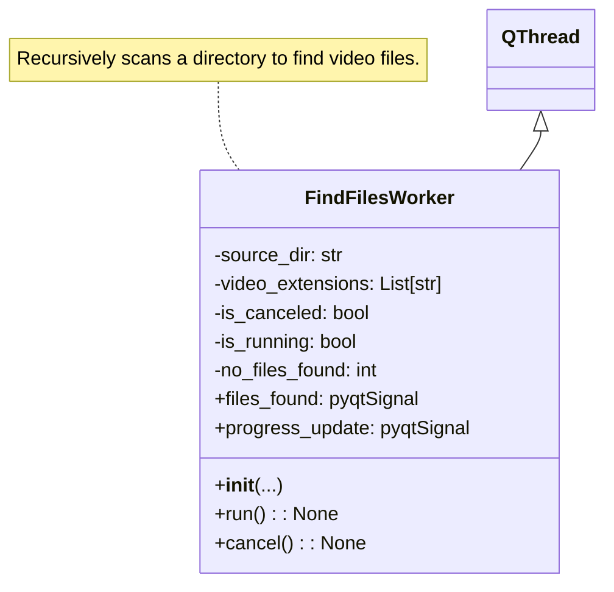
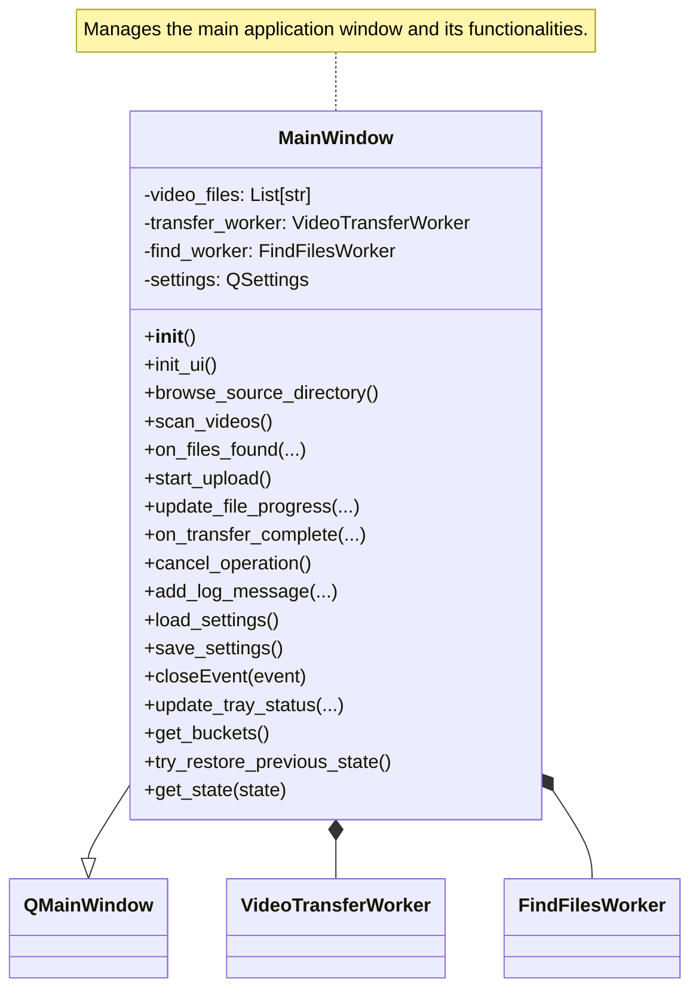

# Sinnerman - Video Transfer Tool
SinnerMan is a Python-based application with a graphical interface built using PyQt5. It uses multithreading for performance and provides seamless video transfer capabilities to DigitalOcean Spaces.
⸻

## 🏆 Features
	•	PyQt5 GUI: User-friendly interface to manage transfers
	•	Multithreading: High performance, concurrent processing
	•	DigitalOcean Integration: Seamless video upload to Spaces

⸻

## 🗂️ Project Structure and Key Components

### 📁 Directory Structure
```
sinnerman/
├── app.py                  # Main GUI application using PyQt5
├── workers/                # Background worker threads
│   ├── mover.py            # Handles video compression & upload to DigitalOcean
│   └── scanner.py          # Scans directories asynchronously for video files
├── .editorconfig           # Code style configuration
├── .gitattributes
├── .gitignore
├── poetry.lock             # Locked dependencies
├── pyproject.toml          # Poetry configuration
├── requirements.txt        # Production dependencies
└── requirements-dev.txt    # Development dependencies
```


⸻
### 🧠 Class Responsibilities

#### 🔄 mover.py
Handles asynchronous video transfer, compression, duplicate detection, and error handling.

#### 🔍 scanner.py
Asynchronously scans a directory for video files, emitting signals to keep the UI responsive.

#### 🖥️ app.py
Main GUI for interacting with the app—select source dir, scan for videos, configure uploads, and start the transfer.

____
## 🚧 Roadmap
	•	Integrated Payment Support
	•	Cross-Platform Compatibility
